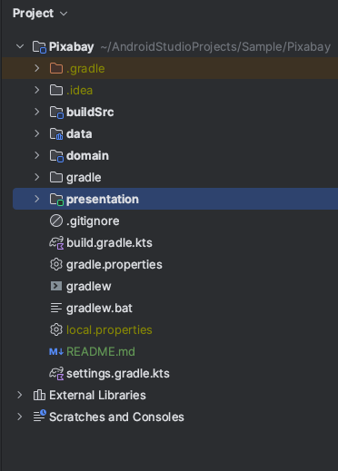
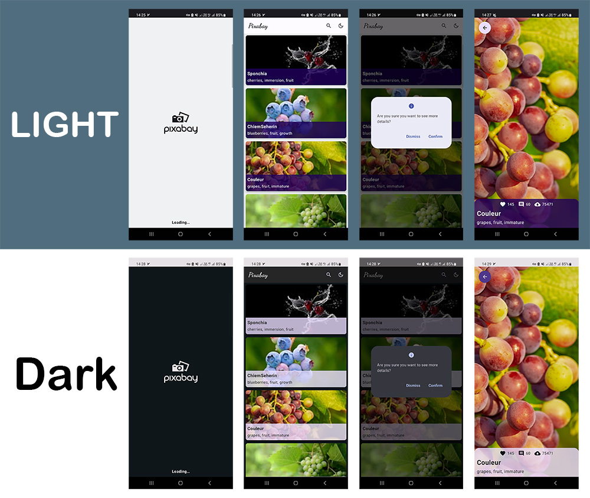

### Pixabay Technical Test

This project is a technical test that showcases a modern Android application development using Kotlin and the latest tech stack.

The app uses the [Pixabay](https://pixabay.com/api/docs/#api_search_images) API service to display the image list based on the search query. It follows the Clean Architecture principles, the Repository Pattern, and the MVVM Architecture. It also uses Jetpack Compose UI toolkit in the presentation layer.

You can download APK file from [this link](https://github.com/msddev/PayBack-Technical-Test/releases/download/v1.0.0/Pixabay-Test.apk).

## Features

1. **Offline-first**: The app can be accessed even without an internet connection.
2. **Pagination**: Efficiently loads large amounts of data to improve the user experience.
3. **Search functionality**: Allows users to quickly find specific information within the app.


## Environment Setup

This project is developed with Android Studio ```Hedgehog (2023.1.1)```.

## Architecture
A well-planned architecture is extremely important for an app to scale and manage the complexity of the code. All architectures have one common goal: to separate the concerns of different modules and layers. This makes it easier to modify, test, and maintain the code.

The clean architecture was proposed by [Robert C. Martin](https://en.wikipedia.org/wiki/Robert_C._Martin) in 2012 in the [Clean Code Blog](http://blog.cleancoder.com/uncle-bob/2012/08/13/the-clean-architecture.html) and it follows the SOLID principle.

### Why Clean Architecture?
- ```Loose coupling between the code``` - The code can easily be modified without affecting any or a large part of the app's codebase thus easier to scale the application later on.
- Easier to ```test``` code.
- ``` Separation of Concern``` - Different modules have specific responsibilities making it easier for modification and maintenance.

### Project Structure
<p align="center"></p>

### Data
The ```data``` layer is responsible for selecting the proper data source for the domain layer. It contains the implementations of the repositories declared in the domain layer.

Components of the data layer include:
- __dataSource__: Represent the component of the data layer and are responsible for managing the data of a particular source (internet, Room, data store, and suchlike)

- __local__: This is responsible for performing caching operations using ```Room``` database.

- __remote__: This is responsible for performing network operations eg. defining API endpoints using ```Retrofit```.

- __di__: Provides the data layer dependencies using ```Dagger Hilt``` dependency injection library.

- __mapper__: Facilitate data transformation between the Data layer and the Domain layer, ensuring a CLEAN (CLear, Encapsulated) architecture.

- __mediator__: Defines a set of callbacks used to incrementally load data from a remote source into a local source wrapped by a PagingSource, e.g., loading data from network into a local db cache.

- __repository__: Responsible for exposing data to the domain layer.

### Domain
This is the core layer of the application. The ```domain``` layer is independent of any other layers thus ] domain business logic can be independent from other layers. This means that changes in other layers will have no effect on the domain layer eg.  screen UI (presentation layer) or changing database (data layer) will not result in any code change within the domain layer.

### Presentation
The ```Presentation``` layer contains components involved in showing information to the user. The main parts of this layer are the views(Activity, and Jetpack Compose Screens) and ViewModels.

## Demo Screenshots



# Tech Stacks
This project uses many of the popular libraries, plugins, and tools of the Android ecosystem.

- [Compose](https://developer.android.com/jetpack/compose)

    - [Material](https://developer.android.com/jetpack/androidx/releases/compose-material) - Build Jetpack Compose UIs with ready-to-use Material Design Components.
    - [Foundation](https://developer.android.com/jetpack/androidx/releases/compose-foundation) - Write Jetpack Compose applications with ready-to-use building blocks and extend the foundation to build your own design system pieces.
    - [UI](https://developer.android.com/jetpack/androidx/releases/compose-ui) - Fundamental components of compose UI needed to interact with the device, including layout, drawing, and input.
    - [Lifecycle-ViewModel](https://developer.android.com/jetpack/androidx/releases/lifecycle) - Perform actions in response to a change in the lifecycle status of another component, such as activities and fragments.
    - [Coil](https://coil-kt.github.io/coil/compose/) - An image-loading library for Android backed by Kotlin Coroutines.

- [Jetpack](https://developer.android.com/jetpack)

    - [Android KTX](https://developer.android.com/kotlin/ktx.html) - Provide concise, idiomatic Kotlin to Jetpack and Android platform APIs.
    - [AndroidX](https://developer.android.com/jetpack/androidx) - Major improvement to the original Android [Support Library](https://developer.android.com/topic/libraries/support-library/index), which is no longer maintained.
    - [Lifecycle](https://developer.android.com/topic/libraries/architecture/lifecycle) - Perform actions in response to a change in the lifecycle status of another component, such as activities and fragments.
    - [ViewModel](https://developer.android.com/topic/libraries/architecture/viewmodel) - Designed to store and manage UI-related data in a lifecycle-conscious way. The ViewModel class allows data to survive configuration changes such as screen rotations.
    - [Paging3](https://kotlinlang.org/) - Load and display small chunks of data at a time.
    - [Room](https://developer.android.google.cn/jetpack/androidx/releases/room) - Persistence library provides an abstraction layer over SQLite to allow for more robust database access while harnessing the full power of SQLite.

- [Dagger Hilt](https://dagger.dev/hilt/) - Dependency Injection library.
- [Google-KSP](https://github.com/google/ksp/) - Kotlin Symbol Processing API
- [Retrofit](https://square.github.io/retrofit/) - Type-safe HTTP client and supports coroutines out of the box.
- [OkHttp-Logging-Interceptor](https://github.com/square/okhttp/blob/master/okhttp-logging-interceptor/README.md) - Logs HTTP request and response data.
- [Flow](https://developer.android.com/kotlin/flow) - Flows are built on top of coroutines and can provide multiple values. A flow is conceptually a stream of data that can be computed asynchronously.
- [Coroutines](https://github.com/Kotlin/kotlinx.coroutines) - Library Support for coroutines, provides runBlocking coroutine builder used in tests.
- [Gson](https://github.com/google/gson) - A modern JSON library for Kotlin and Java.
- [Gradle Kotlin DSL](https://gradle.org/kotlin/) - makes it easy to manage dependency on all module that we have

- [Navigation](https://github.com/raamcosta/compose-destinations) - Annotation processing library for type-safe Jetpack Compose navigation with no boilerplate.

- [Test](https://en.wikipedia.org/wiki/Unit_testing)
    - [Mockk](https://mockk.io/) - A modern Mockk library for UnitTest.
    - [Turbine](https://github.com/cashapp/turbine) - Turbine is a small testing library for kotlinx.coroutines Flow.
    - [Truth](https://github.com/google/truth) - Truth makes your test assertions and failure messages more readable.
    - [Coroutine-Test](https://github.com/Kotlin/kotlinx.coroutines/tree/master/kotlinx-coroutines-test) - Provides testing utilities for effectively testing coroutines.

## ✍️ Authors
👤 **Masoud Khoshkam**
[](https://www.linkedin.com/in/mkdev/)
